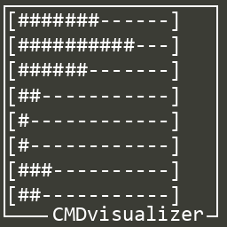

# cmd-visualizer
<p align="center">
  
  
  
</p>
<p align="center">
  
  
  
  
  
  
</p><br>
<p align="center">
  
</p>  
A lightweight terminal-based real-time audio visualizer for Windows, powered by <a href="https://github.com/bastibe/SoundCard">SoundCard</a> and NumPy.  
It captures system audio using WASAPI loopback and displays frequency bars in your terminal.

## Installation
Clone this repository:  
```git clone https://github.com/codeFlane/cmd-visualizer.git```  
Install requirements:  
```pip install numpy click soundcard```

## Usage
```python main.py [OPTIONS]```

### Options
* **-s/--size:** Size of the bars in WIDTH:HEIGHT format (e.g. 150:30)
* **-m/--multiplier:** Amplifies signal intensity (e.g. 1.5, 2.0)
* **-d/--delay:** Delay between updates in seconds (e.g. 0.01, 0.05)
* **-b/--block-size:** FFT block size (samples). Affects precision and responsiveness.
* **--samplerate:** Audio sampling rate (Hz). Affects max frequency captured and FFT spacing.
More detailed documentation in `python main.py --help`

### Example
```python main.py --size 150:40 --delay 0.01 --multiplier 2.0 --block-size 8192 --samplerate 44100```  
This will show a 150-character wide spectrum, with 40 frequency bands, updating every 10 ms.

### Tuning Recommendations
* **Best frequency detail:** --block-size 8192 and --samplerate 44100
* **Lower latency:** --block-size 2048 and --delay 0.01
* **Bass/mid-only focus:** --samplerate 22050 and --size 120:20

## Requirements
* Windows (Linux support soon)
* Python 3.8+
* Terminal with ANSI escape support
* loopback and WASAPI capture support

## License
This project is licensed under the MIT License.

## Acknowledgements
* [soundcard](https://github.com/bastibe/SoundCard)
* [numpy](https://www.numpy.org)
* [click](https://pypi.org/project/click/)

## Roadmap
* [X] CLI support
* [ ] `auto` size mode
* [ ] Add vertical/stacked visual modes (`--vertical`)
* [ ] Colorful interface
* [ ] Create visual themes (minimal, bold, shaded)
* [ ] Themes support (light/dark)
* [ ] Custom bars style
* [ ] Export visualization to `.mp4` via `imageio` or `ffmpeg`
* [ ] Config file support
* [ ] Cross-platform abstraction (Linux loopback via `pyaudio` or `sounddevice`)
* [ ] Refactor core into reusable Python module
* [ ] Demo video
* [ ] Publish to PyPI

## Using as a Library
CMDvisualizer can also be used as a standalone Python module.
You can import its internal functions for your own visualization projects, audio analysis tools, or monitoring dashboards.
### Example
```python
from lib import init, get_device, get_recorder, record

# Initialize band configuration (e.g. 30 frequency ranges)
init(bands_count=30, min=50, max=16000)

# Get default WASAPI loopback input
mic = get_device()

# Record one audio block and extract band energies
with get_recorder(mic) as device:
    band_values = record(device)

print("Band values:", band_values)
```
| Function                      | Description                                          |
| ----------------------------- | ---------------------------------------------------- |
| `init(bands_count, min, max)` | Initializes logarithmic band ranges                  |
| `get_device()`                | Gets the default system audio loopback input         |
| `get_recorder(device)`        | Creates a recorder stream (WASAPI loopback)          |
| `record(device)`              | Captures one audio block and returns per-band energy |

