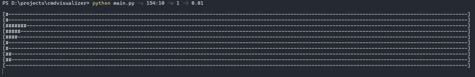

# cmd-visualizer
<p align="center">
  
  
  
</p>
<p align="center">
  
  
  
  
  
  
</p><br>
<p align="center">
  
</p>  
A lightweight terminal-based real-time audio visualizer for Windows, powered by <a href="https://github.com/bastibe/SoundCard">SoundCard</a> and NumPy.  
It captures system audio using WASAPI loopback and displays frequency bars in your terminal.
<p align="center">
  
</p>

## Installation
Clone this repository:  
```git clone https://github.com/codeFlane/cmd-visualizer.git```  
Install requirements:  
```pip install numpy click soundcard```

## Usage
```python main.py [OPTIONS]```

### Options

| Option                      | Description                                |
| --------------------------- | ------------------------------------------ |
| `--reverse`                 | Reverse band order                         |
| `--show-stats`              | Show real-time stats (delay/min/avg/max)   |
| `--disable-fill-dead`       | Disable filling of dead (zero) bands       |
| `--highlight-dead`          | Highlight dead bands that were filled      |
| `-s`, `--size WIDTH:HEIGHT` | Size of the bars (e.g. `150:30`)           |
| `-m`, `--multiplier FLOAT`  | Boost audio intensity                      |
| `-d`, `--delay FLOAT`       | Delay between screen updates (e.g. `0.01`) |
| `-b`, `--block-size INT`    | FFT block size (e.g. 2048, 4096, 8192)     |
| `--samplerate INT`          | Audio sampling rate (Hz)                   |


### Example
```python main.py --size 150:40 --delay 0.01 --multiplier 2.0 --block-size 8192 --samplerate 44100```  
This will show a 150-character wide spectrum, with 40 frequency bands, updating every 10 ms.

### Output
 - Frequency bars rendered per band
 - Bands that were "dead" and filled are shown bold (if highlight-dead enabled)
 - Stats line (if enabled) shows:
    - Delay: current frame time
    - Min: quietest band (in dB)
    - Avg: average band energy (in dB)
    - Max: loudest band (in dB)

### Notes on Accuracy & Performance
The visual quality of frequency bars depends on both `--block-size` (FFT resolution) and `--size` height (band count):
| Block Size | Accuracy     | Speed         | Recommended Usage                         |
| -----------| -------------| --------------| ----------------------------------------- |
| `1024`     | ❌ Low       | ✅ Very fast | Small bars (e.g. `--size 80:10`), testing |
| `2048`     | 🟡 Medium    | ✅ Fast      | ✅ **Recommended default**, good balance  |
| `4096`     | ✅ High      | 🟡 Moderate  | Detailed bars (`--size 150:30`)           |
| `8192`     | 🟢 Very high | ❌ Slower    | Large graphs or precise visualizations    |
| `16384+`   | 🟢 Maximum   | ❌ Laggy     | High-precision use only (may stutter)     |

#### How to Tune for Best Results
 - More bars (higher height in `--size`) = more noise-sensitive.
→ Increase `--block-size` to improve accuracy.

 - Lower --block-size = faster updates but more dead bands (zero lines).
→ Use `--highlight-dead` to visualize them.
→ Use `--disable-fill-dead` to view raw output without smoothing.

 - General tip:
Use `--block-size 2048` for most cases, and increase only if needed.

## Requirements
* Windows (Linux support soon)
* Python 3.8+
* Terminal with ANSI escape support
* loopback and WASAPI capture support

## License
This project is licensed under the [MIT License](./LICENSE).

## Acknowledgements
* [soundcard](https://github.com/bastibe/SoundCard)
* [numpy](https://www.numpy.org)
* [click](https://pypi.org/project/click/)

## Roadmap
* [X] CLI support
* [ ] `auto` size mode
* [ ] Add vertical/stacked visual modes (`--vertical`)
* [ ] Colorful interface
* [ ] Create visual themes (minimal, bold, shaded)
* [ ] Themes support (light/dark)
* [ ] Custom bars style
* [ ] Export visualization to `.mp4` via `imageio` or `ffmpeg`
* [ ] Cross-platform abstraction (Linux loopback via `pyaudio` or `sounddevice`)
* [ ] Demo video

## Using as a Library
CMDvisualizer can also be used as a standalone Python module.
You can import its internal functions for your own visualization projects, audio analysis tools, or monitoring dashboards.
### Example
```python
from lib import init, get_device, get_recorder, record

# Initialize band configuration (e.g. 30 frequency ranges)
init(bands_count=30, min=50, max=16000)

# Get default WASAPI loopback input
mic = get_device()

# Record one audio block and extract band energies
with get_recorder(mic) as device:
    band_values = record(device)

print("Band values:", band_values)
```
| Function                      | Description                                                                              |
| ----------------------------- | ---------------------------------------------------------------------------------------- |
| `init(bands_count, min, max)` | Initializes logarithmic frequency bands                                                  |
| `get_device()`                | Get default WASAPI loopback input                                                        |
| `get_recorder(device)`        | Creates a recording stream                                                               |
| `record(device)`              | Captures one block of audio and returns band values                                      |
| `fill_dead_bands(data)`       | Replaces zero-band values based on neighbors and returns new values and affected indices |
